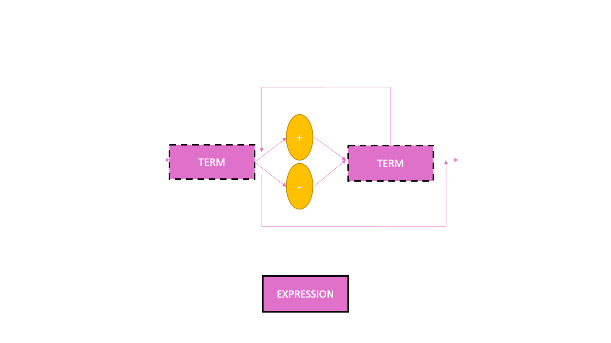

# Compiler
Using python3

## EBNF

program = type, identifier, "(" ((type, identifier), ',')+ ")", commands ;

commands = “{”, command, “;”, { command, “;” }, “}” ;

command = assignment | commands | printf | if | while | declaration ;

assignment = identifier, “=”, expression | scanf | function_call ;

function_call = identifier, "(" ,((expression) ",")+, ")" ;

scanf = "scanf", “(”,“)” ;

printf = "printf", “(”, expression, “)” ;

if = "if", “(”, bool_expression, “)”, commands ;

while = "while",“(”, bool_expression, “)”, commands ;

declaration = type, identifier, { "(" ((type, identifier), ',')+ ")", commands };

return = "return", "(", { ((expression), ",")+ },")"; 

type = "int" | "char" | "void" ;

expression = term, { (“+” | “-”), term } ;

term = factor, { (“*” | “/”), factor } ;

factor = (“+” | “-”), factor | num | “(”, expression, “)” | identifier ;

bool_expression = bool_term, { "||", bool_term } ;

bool_term = bool_factor, { “&&”, bool_factor } ;

bool_factor = { expression, (">" | "<" | "==" ), expression } | bool_factor ;

identifier = letter, { letter | digit | “_” } ;

num = digit, { digit } ;

letter = ( a | ... | z | A | ... | Z ) ;

digit = ( 1 | 2 | 3 | 4 | 5 | 6 | 7 | 8 | 9 | 0 ) ;
## Syntactic diagram
### Program

### Commands

### Type

### Command

### if

### while

### return

### Declaration

### Attribution

### Printf

### Expression

### Term

### Factor

### Bool_Expression

### Bool_Term

### Bool_Factor

### Func_Call
